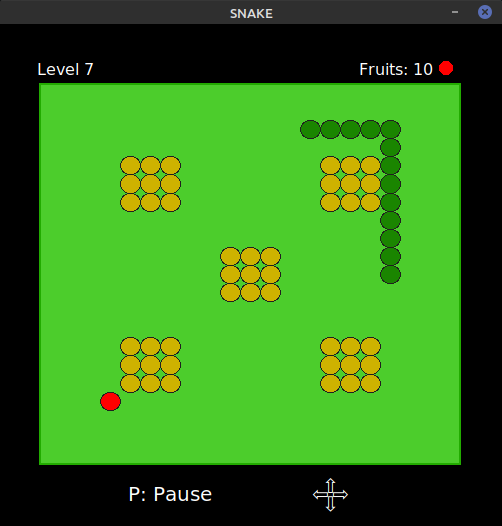
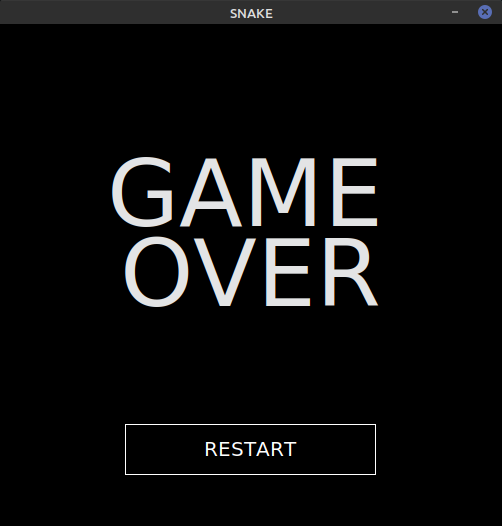

# Snake
Juego Snake

Primer Trabajo Práctico que hice en la Facultad, pero le agrego la Programación Orientada a Objetos y una simple interfaz gráfica.

# Archivos
* main.py: archivo principal donde se ejecuta el desarrollo del juego.

SRC:
  * game.py: contiene la clase Game con sus respectivos métodos
  * snake.py: contiene la Snake con sus respectivos métodos.
  * fruit.py: contiene la Fruit con sus respectivos métodos.
  * obstacle.py: contiene la Obstacle con sus respectivos métodos.
  * program.py: contiene las clases Program con sus respectivos métodos (ciclo del juego).
  * constant.py: contiene las constantes usadas en el programa.

RESOURCES:
  * obstacles.txt: contiene las coordenadas de los distintos obstáculos que se dibujaran en el tablero.

GRAPHICS:
  * gamelib.py: librería utilizada para crear la interfaz gráfica y algunos procesos del juego.
  * graphics.py: contiene las funciones gráficas creadas a partir de la librería gamelib para crear la interfaz gráfica.
 
 IMG:
  * imágenes de muestra del juego.

# Gráficos
La interfaz gráfica se creo utilizando la librería extraída [Gamelib](https://github.com/dessaya/python-gamelib)

